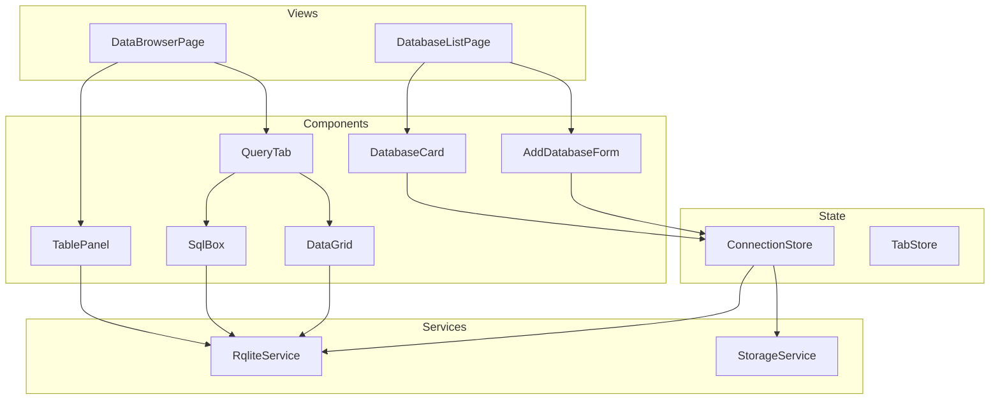

# Design Document: RQLite Browser

## Overview

The RQLite Browser is a single-page application built with Quasar/Vue 3 and TypeScript that provides a graphical interface for managing and querying RQLite databases. The application follows a two-view architecture: a Database List view (homepage) and a Data Browser view with tabbed query interfaces.

The design prioritizes:
- Asynchronous, non-blocking operations for all database interactions
- High performance through pagination and lazy loading
- Clean separation between UI components and data services
- Type-safe interfaces throughout the application

## Architecture



## Components and Interfaces

### Views

#### DatabaseListPage
The homepage displaying all saved database connections with an add button.

```typescript
// src/pages/DatabaseListPage.vue
interface DatabaseListPageState {
  showAddDialog: boolean;
}
```

#### DataBrowserPage
The main browser view with table panel and tabbed query interface.

```typescript
// src/pages/DataBrowserPage.vue
interface DataBrowserPageState {
  connectionId: string;
  tables: string[];
  loading: boolean;
  error: string | null;
}
```

### Components

#### DatabaseCard
Displays a single database connection with name, URL, and actions.

```typescript
// src/components/DatabaseCard.vue
interface DatabaseCardProps {
  connection: DatabaseConnection;
}

interface DatabaseCardEmits {
  (e: 'select', id: string): void;
  (e: 'delete', id: string): void;
}
```

#### AddDatabaseForm
Dialog form for adding new database connections.

```typescript
// src/components/AddDatabaseForm.vue
interface AddDatabaseFormProps {
  modelValue: boolean; // dialog visibility
}

interface AddDatabaseFormEmits {
  (e: 'update:modelValue', value: boolean): void;
  (e: 'saved', connection: DatabaseConnection): void;
}

interface FormState {
  name: string;
  url: string;
  loading: boolean;
  error: string | null;
}
```

#### TablePanel
Left sidebar showing database tables.

```typescript
// src/components/TablePanel.vue
interface TablePanelProps {
  tables: string[];
  activeTable: string | null;
}

interface TablePanelEmits {
  (e: 'select', tableName: string): void;
}
```

#### QueryTab
Container for SQL box and data grid, represents one tab.

```typescript
// src/components/QueryTab.vue
interface QueryTabProps {
  connectionId: string;
  tableName: string;
}

interface QueryTabState {
  sql: string;
  data: QueryResult | null;
  loading: boolean;
  error: string | null;
  pagination: PaginationState;
}
```

#### SqlBox
Fixed SQL input area with execute button.

```typescript
// src/components/SqlBox.vue
interface SqlBoxProps {
  modelValue: string;
  loading: boolean;
}

interface SqlBoxEmits {
  (e: 'update:modelValue', value: string): void;
  (e: 'execute'): void;
}
```

#### DataGrid
Paginated, editable table using Quasar's q-table with q-popup-edit.

```typescript
// src/components/DataGrid.vue
interface DataGridProps {
  columns: ColumnDef[];
  rows: Record<string, unknown>[];
  loading: boolean;
  pagination: PaginationState;
  primaryKey?: string;
}

interface DataGridEmits {
  (e: 'update:pagination', value: PaginationState): void;
  (e: 'cell-edit', payload: CellEditPayload): void;
}

interface CellEditPayload {
  row: Record<string, unknown>;
  column: string;
  oldValue: unknown;
  newValue: unknown;
}
```

## Data Models

### Core Types

```typescript
// src/types/database.ts

interface DatabaseConnection {
  id: string;
  name: string;
  url: string;
  createdAt: number;
}

interface QueryResult {
  columns: string[];
  types: string[];
  values: unknown[][];
  rowsAffected?: number;
  lastInsertId?: number;
  time?: number;
}

interface ColumnDef {
  name: string;
  label: string;
  field: string;
  sortable: boolean;
  align: 'left' | 'center' | 'right';
  type?: string;
}

interface PaginationState {
  page: number;
  rowsPerPage: number;
  rowsNumber: number;
}

interface TabState {
  id: string;
  tableName: string;
  sql: string;
  isCustomQuery: boolean;
}
```

### RQLite API Response Types

```typescript
// src/types/rqlite.ts

// Response when using associative format (key-value pairs per row)
interface RqliteAssociativeResponse {
  results: RqliteAssociativeResult[];
  time?: number;
}

interface RqliteAssociativeResult {
  columns?: string[];
  types?: string[];
  rows?: Record<string, unknown>[]; // associative format returns rows as objects
  error?: string;
  rows_affected?: number;
  last_insert_id?: number;
}

// Response for execute operations
interface RqliteExecuteResponse {
  results: RqliteExecuteResult[];
  time?: number;
}

interface RqliteExecuteResult {
  rows_affected?: number;
  last_insert_id?: number;
  raft_index?: number; // returned when raft_index param is used
  error?: string;
}

// Parameterized statement format for safe SQL execution
type ParameterizedStatement = [string, ...unknown[]]; // [sql, ...params]

```

### Store Types

```typescript
// src/stores/connection-store.ts
interface ConnectionStoreState {
  connections: DatabaseConnection[];
  activeConnectionId: string | null;
}

// src/stores/tab-store.ts
interface TabStoreState {
  tabs: Map<string, TabState[]>; // connectionId -> tabs
  activeTabId: Map<string, string>; // connectionId -> activeTabId
}
```

## Services

### RqliteService

Handles all HTTP communication with RQLite databases using Axios, following RQLite API best practices.

```typescript
// src/services/rqlite-service.ts
import axios, { AxiosInstance } from 'axios';

class RqliteService {
  private client: AxiosInstance;
  private leaderUrl: string | null = null;
  
  constructor(baseUrl: string) {
    this.client = axios.create({
      baseURL: baseUrl,
      timeout: 30000,
      headers: { 'Content-Type': 'application/json' }
    });
  }
  
  /**
   * Data Grid Browsing - Fast reads with associative format
   * Endpoint: GET /db/query?associative&level=none
   * - associative: Returns rows as key-value objects (q-table compatible)
   * - level=none: Fastest read, no cluster consensus check
   */
  async query(sql: string): Promise<RqliteAssociativeResult>;
  async queryWithPagination(
    table: string, 
    page: number, 
    pageSize: number
  ): Promise<RqliteAssociativeResult>;
  
  /**
   * Raw SQL Console - Auto-detects read vs write
   * Endpoint: POST /db/request?associative&db_timeout=5s
   * - Uses sqlite3_stmt_readonly() to detect query type
   * - db_timeout: Prevents runaway queries
   */
  async request(sql: string): Promise<RqliteAssociativeResult | RqliteExecuteResult>;
  
  /**
   * Inline Cell Editing - Parameterized writes
   * Endpoint: POST /db/execute?redirect
   * - Uses parameterized statements to prevent SQL injection
   * - redirect: Auto-routes to Leader node for writes
   */
  async execute(statement: ParameterizedStatement): Promise<RqliteExecuteResult>;
  
  /**
   * Batch Updates - Transaction support
   * Endpoint: POST /db/execute?transaction&redirect
   * - Wraps multiple edits in single Raft log entry
   */
  async executeBatch(statements: ParameterizedStatement[]): Promise<RqliteExecuteResult[]>;
  
  /**
   * Schema Operations
   * Endpoint: GET /db/query?associative&level=none
   */
  async getTables(): Promise<string[]>;
  async getTableSchema(table: string): Promise<ColumnDef[]>;
  async getTablePrimaryKey(table: string): Promise<string | null>;
  
  /**
   * Connection Test
   * Endpoint: GET /status
   */
  async testConnection(): Promise<boolean>;
  
  /**
   * Helper: Check for error in response payload
   * CRITICAL: RQLite returns HTTP 200 even for SQL errors
   */
  private checkResponseError(result: { error?: string }): void;
}
```

### API Endpoint Summary

| UI Feature | Endpoint | Method | Key Parameters |
|------------|----------|--------|----------------|
| Grid Browsing | `/db/query` | GET/POST | `associative`, `level=none` |
| Inline Editing | `/db/execute` | POST | `redirect`, parameterized JSON |
| Raw Console | `/db/request` | POST | `associative`, `db_timeout` |
| Batch Updates | `/db/execute` | POST | `transaction`, `redirect` |
| Schema Info | `/db/query` | GET | `q=PRAGMA table_info(name)` |
```

### StorageService

Handles local storage persistence for database connections.

```typescript
// src/services/storage-service.ts

const STORAGE_KEY = 'rqlite-browser-connections';

class StorageService {
  static saveConnections(connections: DatabaseConnection[]): void;
  static loadConnections(): DatabaseConnection[];
  static addConnection(connection: DatabaseConnection): void;
  static removeConnection(id: string): void;
}
```

## Correctness Properties

*A property is a characteristic or behavior that should hold true across all valid executions of a system—essentially, a formal statement about what the system should do. Properties serve as the bridge between human-readable specifications and machine-verifiable correctness guarantees.*

### Property 1: Connection Persistence Round Trip

*For any* valid DatabaseConnection object, saving it to storage and then loading all connections should return a list containing an equivalent connection object.

**Validates: Requirements 7.1, 7.2**

### Property 2: Tab Uniqueness Per Table

*For any* sequence of table selections on a single database connection, the number of open tabs should equal the number of unique tables selected.

**Validates: Requirements 3.1, 3.3**

### Property 3: Pagination Consistency

*For any* table with N rows and page size P, navigating through all pages should yield exactly N total rows with no duplicates.

**Validates: Requirements 5.2, 5.3, 5.4**

### Property 4: Cell Edit Generates Valid SQL

*For any* cell edit operation with a valid primary key, the generated UPDATE SQL should be syntactically valid and target exactly one row.

**Validates: Requirements 6.2**

### Property 5: Connection List Integrity

*For any* sequence of add and delete operations on database connections, the final list should contain exactly the connections that were added but not deleted.

**Validates: Requirements 1.3, 1.6**

## Error Handling

### Critical: Check Response Payload for Errors
RQLite returns HTTP 200 OK even when SQL errors occur. The error is embedded in the JSON response:
```typescript
// ALWAYS check for error key in response
if (result.error) {
  throw new RqliteError(result.error);
}
```

### Connection Errors
- Network failures: Display toast notification with retry option
- Invalid URL: Show inline validation error in AddDatabaseForm
- Authentication failures: Display error dialog with connection details
- Leader redirect (301): Update base URL to Leader node automatically

### Query Errors
- Syntax errors: Display RQLite error message below SqlBox
- Timeout: Show timeout notification with option to cancel (use `db_timeout` param)
- Connection lost: Display reconnection dialog

### Edit Errors
- Constraint violations: Revert cell, show error toast
- Concurrent modification: Refresh row data, show conflict notification
- Network failure: Revert cell, show retry option

### Error Display Strategy
```typescript
interface ErrorState {
  type: 'validation' | 'network' | 'query' | 'edit';
  message: string;
  details?: string;
  retryable: boolean;
}

class RqliteError extends Error {
  constructor(message: string, public sqlError?: string) {
    super(message);
    this.name = 'RqliteError';
  }
}
```

## Testing Strategy

### Unit Tests
- Test StorageService serialization/deserialization
- Test SQL generation for pagination queries
- Test SQL generation for UPDATE statements
- Test column definition parsing from schema

### Property-Based Tests
Using fast-check for TypeScript:

1. **Connection Round Trip** (Property 1): Generate random DatabaseConnection objects, save/load, verify equality
2. **Tab Uniqueness** (Property 2): Generate random table selection sequences, verify tab count equals unique tables
3. **Pagination Consistency** (Property 3): Generate mock datasets, verify page navigation covers all rows
4. **Edit SQL Generation** (Property 4): Generate random cell edits, verify SQL validity
5. **Connection List Integrity** (Property 5): Generate add/delete sequences, verify final state

### Integration Tests
- Test actual RQLite queries against a test database
- Test full edit flow from click to save
- Test tab management with multiple tables

### Test Configuration
- Property tests: minimum 100 iterations per property
- Use fast-check library for property-based testing
- Tag format: **Feature: rqlite-browser, Property {number}: {property_text}**
